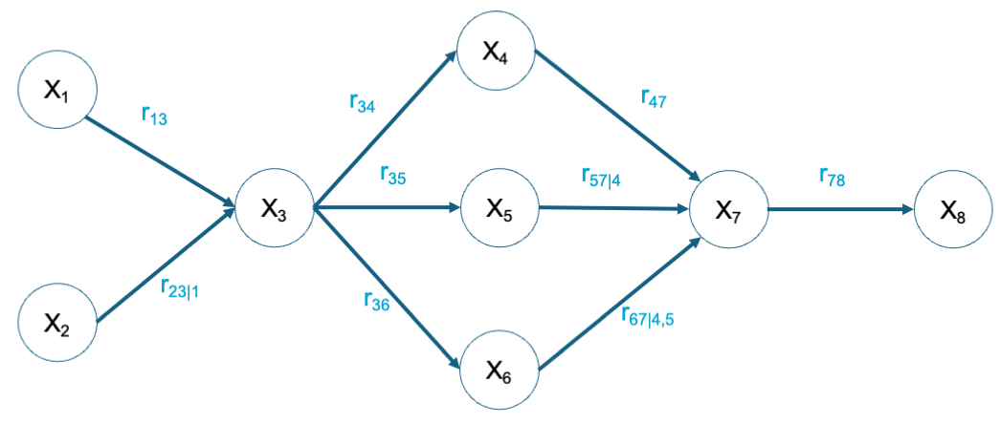

# Semantics of NPBNs

In previous section, you have seen how to assign (un)conditional rank correlations to a DAG and the rank correlation matrix as a representation of the NPBN. If you want to read more about NPBN and their semantics, we refer you to Pearl (1988)[^pearl].

In this section, you will see the meaning of the DAG in terms of (un)conditional dependence or independence and how that translates to the rank correlation matrix. To do so, we will analyze the three basic cases of NPBN on 3 nodes shown in the Figure below.

```{figure} ./figures/DAGs.png

---

---
Cases of DAGs on 3 nodes.
```

## Case (a): 1 $\rightarrow$ 2 $\rightarrow$ 3

```{figure} ./figures/case_a.png

---

---
Case (a).
```

In this first case, $X_1$ is the parent of $X_2$ and $X_2$ is the parent of $X_3$. The first thing that we can derive from the DAG is that $X_1 \cancel{\perp} X_2$ and $X_2 \cancel{\perp} X_3$ as there are direct statements of the dependence between the variables. Moreover, due to the direction of the arrows in this case as a sequence, $X_1 \cancel{\perp} X_3$. This is, the dependence between $X_1$ and $X_3$ is inferred through the DAG. However, $X_1$ and $X_3$ become independent once I know the value of $X_2$ (mathematically $X_1 \perp X_3|X_2$). Therefore, the rank correlation matrix that would be derived from this NPBN would be complete as

$$
\begin{pmatrix}
1 \ \ \ r_{12} \ \ \ r_{13}\\
r_{21} \ \ 1 \ \ \ r_{23} \\
r_{31} \ \ r_{32} \ \ \ 1\\
\end{pmatrix}
$$

### Let's see it with examples!

The first example is with a discrete Bayesian Network (DBN) and, thus, with discrete variables. In the Figure below, you have a DBN with the following nodes: (1) the probability that it snows, (2) the probability that the train is late, and (3) the probability that you, as train used, are late. If it snows, it is much more likely that the train is late due to the metheorological conditions and, thus, that you are also late. Therefore, (1) and (3) are not independent, as we saw before. However, once I know that the train is late, the probability of being late is not affected any more about the fact that it snows or not. This is, (1) and (3) become independent once I know (2), as we saw before

```{figure} ./figures/discrete_case_a.png

---

---
Discrete case (a).
```

Let's make the variables continuous now. In the Figure below, you have a NPBN with the following random variables in the nodes: (1) accumulated milimeters of snow a day, (2) minutes of delay of a train, and (3) minutes of delay to my destination. They are, thus, continuous variables quantified with continuous distribution functions. 

```{figure} ./figures/continuous_case_a.png

---

---
Continuous case (a).
```

If the probability of high values of snow increase for a day, the probabilitiy of a higher delay of the train also increases and, together with it, also the probability of higher delay for me. However, once I know how many minutes the train is late, the amount of snow does not have an influence on my expected delay.

## Case (b): 1 $\leftarrow$ 2 $\rightarrow$ 3

```{figure} ./figures/case_b.png

---

---
Case (b).
```

In this second case, $X_2$ is the parent of both $X_1$ and $X_3$. The first thing that we can derive from the DAG is that $X_1 \cancel{\perp} X_2$ and $X_2 \cancel{\perp} X_3$ as there are direct statements of the dependence between the variables. Moreover, since both $X_1$ and $X_3$ depend on $X_2$, they are not independent ($X_1 \cancel{\perp} X_3$). This is, the dependence between $X_1$ and $X_3$ is inferred through the DAG. However, $X_1$ and $X_3$ become independent once I know the value of $X_2$ (mathematically $X_1 \perp X_3|X_2$). Therefore, the rank correlation matrix that would be derived from this NPBN would be complete as

$$
\begin{pmatrix}
1 \ \ \ r_{12} \ \ \ r_{13}\\
r_{21} \ \ 1 \ \ \ r_{23} \\
r_{31} \ \ r_{32} \ \ \ 1\\
\end{pmatrix}
$$

### Let's see it with examples!

The first example is with discrete variables. In the Figure below, you have a DBN with the following nodes: (1) the probability of having lung cancer, (2) the probability of smoking, and (3) the probability of having bronchitis. According to several studies, smokers are more prone to develing lung conditions such as bronchitis and lung cancer. Thus, having bronchitis makes more likely to be a smoker and, thus, develop lung cancer ($X_1 \cancel{\perp} X_3$). However, once I know that somebody smokes, the fact of having bronchitis does not provide me with more information to determine what is the probability of that person having lung cancer ($X_1 \perp X_3| X_2$)

```{figure} ./figures/discrete_case_b.png

---

---
Discrete case (b).
```

Let's make the variables continuous now. In the Figure below, you have a NPBN with the following random variables in the nodes: (1) forces on buildings due to wind, (2) wind speed, and (3) wave height of the wind-generated waves. They are, thus, continuous variables quantified with continuous distribution functions. 

```{figure} ./figures/continuous_case_b.png

---

---
Continuous case (b).
```

When the wind blows along a coastal city, it generates waves near the shore and also impacts the building in the city generating forces on them. The higher the wind speed, the more probable become high forces on the buildings and high wave heights. High wind forces on the buildings make more likely high wind speeds and, thus, high wave heights. Therefore, $X_1 \cancel{\perp} X_3$. However, once I know the value of the wind speed, observing high values of the wave height does not provide me with more information about the wind forces on the buildings ($X_1 \perp X_3|X_2$).

## Case (c): 1 $\rightarrow$ 2 $\leftarrow$ 3

```{figure} ./figures/case_c.png

---

---
Case (c).
```

In the third case, $X_2$ is the child of both $X_1$ and $X_3$. The first thing that we can derive from the DAG is that $X_1 \cancel{\perp} X_2$ and $X_2 \cancel{\perp} X_3$ as there are direct statements of the dependence between the variables. $X_2$ depends on $X_1$ and $X_3$, but not the other way around. Therefore, $X_1 \perp X_3$. Nevertheless, $X_1$ and $X_3$ become dependent once I know the value of $X_2$ (mathematically $X_1 \cancel{\perp} X_3|X_2$). Therefore, the rank correlation matrix that would be derived from this NPBN would be complete as

$$
\begin{pmatrix}
1 \ \ \ r_{12} \ \ \ 0\\
r_{21} \ \ 1 \ \ \ r_{23} \\
0 \ \ r_{32} \ \ \ 1\\
\end{pmatrix}
$$

### Let's see it with examples!

The first example is with discrete variables. In the Figure below, you have a DBN with the following nodes: (1) the probability of burglary, (2) the probability of the alarm of the house ringing, and (3) the probability of an earthquake happening. The fact that the alarm rings can be then cause by either an earthquake or burglary. However, the fact that there is an earthquake has nothing to do with the probability of somebody breaking in the house ($X_1 \perp X_3$). This changes once the alarm rings: if there is an earthquake, it is potentially the cause of making the alarm ring and, thus, burglary is less likely ($X_1 \cancel{\perp} X_3|X_2$)

```{figure} ./figures/discrete_case_c.png

---

---
Discrete case (c).
```

Let's make the variables continuous now. In the Figure below, you have a NPBN with the following random variables in the nodes: (1) axle loads of trucks over a bridge, (2) quantitative damage that the elements of the bridge suffer, and (3) the intensity of the earthquake. They are, thus, continuous variables quantified with continuous distribution functions. 

```{figure} ./figures/continuous_case_c.png

---

---
Example of a NPBN for case (c) with the two possible combinations of (un)conditional rank correlations in the arcs.
```

When the trucks go over the bridge, the loads induced through their axles go deteriorating over time the bridge and, thus, gradually increasing the damage. The higher the axle loads, more likely to observe higher values of deterioration in the bridge. The same holds for the earthquake intensity: the higher the intensity, the more likely to observe higher values of damage in the bridge. However, the intensity of the earthquake does not have anything to do with the axle loads of the trucks. Nevertheless, if I observe a high value of damage in the bridge, this change. If I also observe a high intensity of an earthquake, it is likely that the cause of the damage is the earthquake and, thus, it is less likely to observe high values of the axle loads.

## It's your turn now!

Define the rank correlation matrix for the following graph.



```{admonition} Solution
:class: tip, dropdown

$$
\begin{pmatrix}
1 \ \ \ 0 \ \ \ r_{13} \ \ \ r_{14} \ \ \ r_{15} \ \ \ r_{16} \ \ \ r_{17} \ \ \ r_{18}\\
0 \ \ \ 1 \ \ \ r_{23} \ \ \ r_{24} \ \ \ r_{25}  \ \ \ r_{26} \ \ \ r_{27} \ \ \ r_{28}\\
r_{13} \ \ r_{23} \ \ \ 1 \ \ \ r_{34} \ \ \ r_{35}  \ \ \ r_{36} \ \ \ r_{37} \ \ \ r_{38}\\
r_{14} \ \ r_{24} \ \ \ r_{34} \ \ \ 1 \ \ \ r_{45}  \ \ \ r_{46} \ \ \ r_{47} \ \ \ r_{48}\\
r_{15} \ \ r_{25} \ \ \ r_{35} \ \ \ r_{45} \ \ \ 1  \ \ \ r_{56} \ \ \ r_{57} \ \ \ r_{58}\\
r_{16} \ \ r_{26} \ \ \ r_{36} \ \ \ r_{46} \ \ \ r_{56}  \ \ \ 1 \ \ \ r_{67} \ \ \ r_{68}\\
r_{17} \ \ r_{27} \ \ \ r_{37} \ \ \ r_{47} \ \ \ r_{57}  \ \ \ r_{67} \ \ \ 1 \ \ \ r_{78}\\
r_{18} \ \ r_{28} \ \ \ r_{38} \ \ \ r_{48} \ \ \ r_{58}  \ \ \ r_{68} \ \ \ r_{78} \ \ \ 1\\
\end{pmatrix}
$$

```


[^pearl]: Pearl, J. Probabilistic reasoning in intelligent systems : networks of plausible inference. Available [here](https://tudelft.on.worldcat.org/search/detail/927108286?queryString=Probabilistic%20reasoning%20in%20intelligent%20systems%3A%20networks%20of%20plausible%20inference).